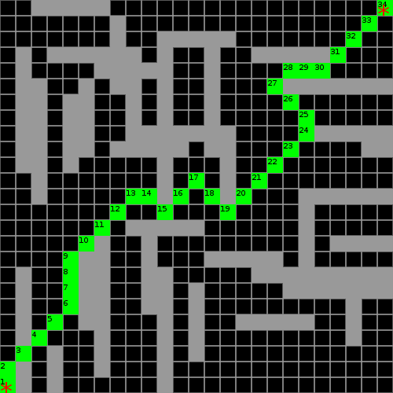

# lua-star

Lua-star is a pure Lua A* path-finding library.

# Quick Start

Easy to use, it will make you more attractive and you feel sensual doing so.

    local luastar = require("lua-star")

    function positionIsOpenFunc(x, y)
        -- should return true if the position is open to walk
        return mymap[x][y] == walkable
    end

    local path = luastar:find(width, height, start, goal, positionIsOpenFunc, useCache, excludeDiagonalMoving)

`path` will be false if no path was found, otherwise it contains a list of points that travel from `start` to `goal`:

    if path then
        for _, p in ipairs(path) do
            print(p.x, p.y)
        end
    end

Lua star does not care how your map data is arranged, it simply asks you if the map position at `x,y` is walkable via a callback.

`width` and `height` is your map size.

`start` and `goal` are tables with at least the `x` and `y` keys.

    local start = { x = 1, y = 10 }
    local goal = { x = 10, y = 1 }

`positionIsOpenFunc(x, y)` is a function that should return true if the position is open to walk.

`useCache` is optional and defaults to `false` when not given. If you have a map that does not change, caching can give a speed boost.

If at any time you need to clear all cached paths:

    luastar:clearCached()

`excludeDiagonalMoving` also optional value  defaults to `false`. If you want to exclude the possibility of moving diagonally set the value `true`. i.e, by default, diagonal movement is **enabled**

# Requirements

* [Lua 5.x](http://www.lua.org/)

For running unit tests:

* [Lua Rocks](https://luarocks.org/)
* busted

These commands are for apt-based systems, please adapt to them as needed.

    sudo apt-get install luarocks
    sudo luarocks install busted

Unit testing is done with busted, the `.busted` config already defines everything, so simply run:

    busted

# Performance

There is a performance measurement tool in `tests/performance.lua`, it calculates the average time to find a path on a large, random map.

    # copy the lib to tests
    $ cp ../src/lua-star.lua .

    # measure performance
    $ lua performance.lua
    Running with seed 1540584306
    Building a map of 3000x3000...
    Precalculating 6000 random start/goal positions...
    Finding 1000 paths...
        Done in 16.37 seconds.
        That is 0.0164 seconds, or 16 milliseconds, per path.
        The map has 9.0 million locations, with about 65% open space.

# Example

There is an [interactive example](example/main.lua) that can be run with [Love](https://love2d.org).

# License

See the file [LICENSE](LICENSE)
